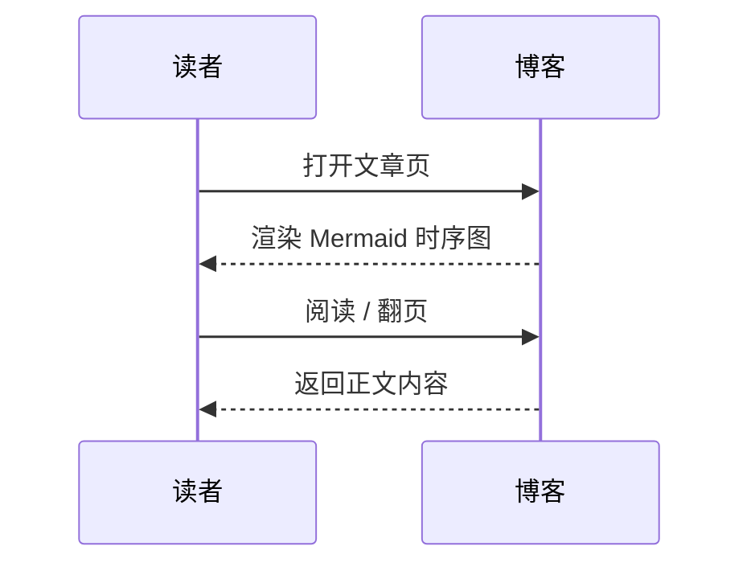
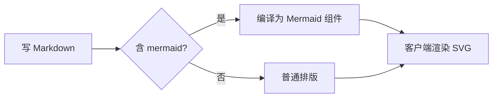

# 📘 Markdown 功能演示文档

> 本文档是一份 **Markdown 全覆盖范文**，涵盖标题、文本样式、列表、表格、代码块、引用、链接、图片、分割线、任务清单、数学公式、HTML 混用等常用语法，可直接作为速查表使用。

---

## 一、标题层级

# 一级标题（H1）
## 二级标题（H2）
### 三级标题（H3）
#### 四级标题（H4）
##### 五级标题（H5）
###### 六级标题（H6）

---

## 二、基础文本样式

这是一段普通正文，用于展示 **加粗重点**、*斜体强调*、***加粗斜体***、~~删除线~~，以及 `行内代码` 的效果。

还可以使用 <u>下划线</u>（部分渲染器支持 HTML 标签）。

---

## 三、引用块

> 💡 这是单行引用，适合放提示、名言或备注。

> 这是多行引用，
> 每行前面加 `>` 即可。
>
> 中间空一行可以分段。

---

## 四、列表

### 1. 无序列表

- 🍎 苹果
- 🍌 香蕉
  - 🥭 小米蕉
  - 🍌 芭蕉
- 🍊 橘子

### 2. 有序列表

1. 打开编辑器
2. 编写 Markdown
3. 预览效果
4. 导出或发布

### 3. 任务清单

- [x] 安装 Markdown 编辑器
- [x] 写完标题
- [x] 添加表格
- [ ] 补充流程图
- [ ] 导出为 PDF

---

## 五、链接与图片

### 链接

- 普通链接：[腾讯元宝](https://yuanbao.tencent.com)
- 带标题链接：[Google](https://www.google.com "谷歌搜索")
- 邮箱链接：[your@email.com](mailto:your@email.com)

### 图片


---

## 六、代码块

### 行内代码

使用 `git clone` 命令克隆仓库，或运行 `npm install` 安装依赖。

### 围栏代码块（带语法高亮）

```javascript
/**
 * 计算两数之和
 */
function add(a, b) {
  return a + b;
}

console.log(add(3, 5)); // 输出: 8
```

```python
# Python 示例：斐波那契数列
def fib(n):
    a, b = 0, 1
    for _ in range(n):
        print(a, end=" ")
        a, b = b, a + b

fib(10)
```

```bash
# 终端命令示例
mkdir my-project
cd my-project
npm init -y
```

```sql
-- SQL 查询示例
SELECT name, age
FROM users
WHERE age > 18
ORDER BY age DESC;
```

---

## 七、表格

### 基础表格

| 功能     | 语法            | 渲染效果      |
| -------- | --------------- | ------------- |
| 加粗     | `**文本**`      | **重点**      |
| 斜体     | `*文本*`        | *强调*        |
| 删除线   | `~~文本~~`      | ~~废弃~~      |
| 行内代码 | `` `代码` ``    | `npm install` |

### 对齐方式

| 左对齐 | 居中对齐 | 右对齐 |
| :----- | :------: | -----: |
| 苹果   |   香蕉   |    橘子 |
| 红色   |   黄色   |    橙色 |

---

## 八、分割线

以下是三种分割线写法（效果相同）：

---

---

***

---

## 九、转义字符

有些符号需要转义才能正常显示：

- 星号：\*
- 反引号：\`
- 方括号：\[
- 井号：\#

---

## 十、数学公式（部分平台支持）

行内公式：$E = mc^2$

独立公式：

$$
\int_{a}^{b} f(x)\,dx = F(b) - F(a)
$$

$$
\sum_{i=1}^{n} i = \frac{n(n+1)}{2}
$$

---

## 十一、HTML 混用（扩展能力）

<details>
<summary>🔽 点击展开折叠区域</summary>

Markdown 本身不支持折叠面板，但很多平台允许内嵌 HTML 来实现更丰富的效果。

- 支持自定义样式
- 支持交互组件
- 适合放补充说明

</details>

<center>这是居中文本（HTML 实现）</center>

---

## 十二、表情符号（Emoji）

| 场景     | Emoji |
| -------- | ----- |
| 成功     | ✅    |
| 警告     | ⚠️    |
| 错误     | ❌    |
| 进行中   | 🚧    |
| 完成     | 🎉    |
| 小贴士   | 💡    |

---

## 十三、目录（手动维护示例）

- [一、标题层级](#一标题层级)
- [二、基础文本样式](#二基础文本样式)
- [三、引用块](#三引用块)
- [四、列表](#四列表)
- [五、链接与图片](#五链接与图片)
- [六、代码块](#六代码块)
- [七、表格](#七表格)
- [八、分割线](#八分割线)
- [九、转义字符](#九转义字符)
- [十、数学公式](#十数学公式部分平台支持)
- [十一、HTML 混用](#十一html-混用扩展能力)
- [十二、表情符号](#十二表情符号emoji)
- [十三、目录](#十三目录手动维护示例)

---

## 十四、Mermaid 图表（时序图 / 流程图）

用 ` ```mermaid ` 代码块即可嵌入时序图、流程图、类图、ER 图等，渲染成 SVG：





---

✅ **本文档覆盖了日常 90% 以上的 Markdown 使用场景**，包括排版、结构化、代码展示、数据表格、多媒体、扩展语法等，可直接作为模板使用。

---

*Generated on 2026-08-11 · Powered by Markdown*
