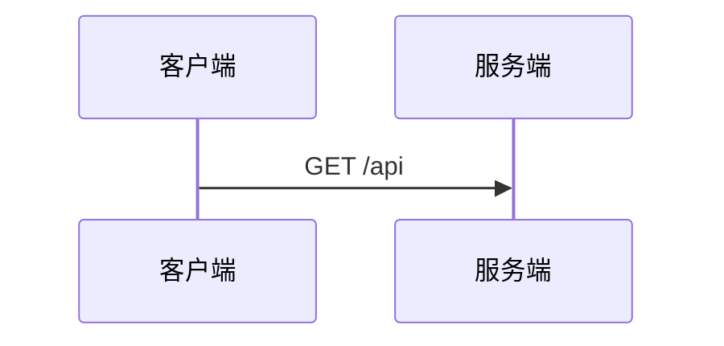

# 第 7 节 · MDX 内容渲染

> 博客正文是 MDX：既能写 Markdown，又能内嵌 React 组件。文章里画流程图、时序图、类图都没问题。
> 这一节讲编译管线、自定义 remark 插件把 ` ```mermaid ` 变成组件、TOC 提取，以及纸感排版组件。

---

## 一、数据流：从数据库到页面

```
DB 里的 MDX 文本 ──▶ safeSource 预处理 ──▶ compileMDX ──▶ React 元素 ──▶ 页面
                              │
                              └─ remark 插件：remark-gfm、remarkMermaid
                              └─ rehype 插件：rehype-slug（标题锚点）
```

`lib/mdx.ts` 的核心：

```ts
export async function renderMDX(source: string) {
  const { content } = await compileMDX({
    source: safeSource(source),
    components: MDXComponents,          // 自定义排版组件
    options: {
      parseFrontmatter: false,
      mdxOptions: {
        remarkPlugins: [remarkGfm, remarkMermaid],
        rehypePlugins: [rehypeSlug],
      },
    },
  });
  return content;
}
```

`compileMDX` 来自 `next-mdx-remote/rsc`，在 **Server Component** 里 `await` 使用，编译发生在渲染期（对 SSG 就是构建期）。

## 二、防御性预处理：`safeSource`

一个真实的坑：Markdown 里写邮箱 `<xxx@yyy.com>`，MDX 会把尖括号当 **JSX 标签**解析，`@` 直接报错。

```ts
function safeSource(source: string): string {
  return source.replace(
    /<([A-Za-z0-9._%+-]+@[A-Za-z0-9.-]+\.[A-Za-z]{2,})>/g,
    (_, email) => `[${email}](mailto:${email})`   // 转成规范 markdown 链接
  );
}
```

一行正则，提前把裸邮箱转成链接，绕过 JSX 解析。

## 三、自定义 remark 插件：mermaid → 组件

这是全文最精巧的一段。需求：文章里写

````markdown

````

渲染成可交互的 SVG 图。

**思路**：写一个 remark 插件，遍历 Markdown 的语法树（MDAST），把 `code` 节点（lang=mermaid）改写成 JSX 元素 `<Mermaid code="..." />`，然后 MDX 编译器就能识别这个组件。

```ts
function walkAst(node, visit) {
  if (!node || typeof node !== "object") return;
  const children = node.children;
  if (Array.isArray(children)) children.forEach((c) => walkAst(c, visit));
  visit(node);
}

function remarkMermaid() {
  return (tree) => {
    walkAst(tree, (node) => {
      if (node.type !== "code" || node.lang !== "mermaid") return;
      // code 节点 → mdxJsxFlowElement（MDX 的 JSX 元素节点）
      node.type = "mdxJsxFlowElement";
      node.name = "Mermaid";
      node.attributes = [{ type: "mdxJsxAttribute", name: "code", value: node.value ?? "" }];
      node.children = [];
      delete node.value;
      delete node.lang;
    });
  };
}
```

要点：
- **只改节点类型和名字**，结构不动 —— 这就是 MDX 生态里「写插件把代码块转组件」的标准做法（跟 docusaurus、rehype-* 是同一套路）。
- 手写 `walkAst` 做轻量遍历，不必引整个 `unist-util-visit`。

## 四、Mermaid 客户端组件

转换出的 `<Mermaid>` 是 `"use client"` 组件，在浏览器里真正画图：

```tsx
"use client";
import { useEffect, useId, useRef, useState } from "react";

export default function Mermaid({ code }: { code: string }) {
  const uid = useId().replace(/[^a-zA-Z0-9]/g, "");
  const boxRef = useRef<HTMLDivElement>(null);
  const [error, setError] = useState<string | null>(null);

  useEffect(() => {
    let cancelled = false;
    (async () => {
      try {
        const mermaid = (await import("mermaid")).default;   // 动态 import 懒加载
        mermaid.initialize({
          startOnLoad: false,
          securityLevel: "loose",
          theme: "base",
          themeVariables: {
            fontFamily: '"Noto Sans SC", "PingFang SC", sans-serif',
            fontFamilyCode: '"IBM Plex Mono", monospace',
          },
        });
        const { svg } = await mermaid.render(`mermaid-${uid}`, code);
        if (!cancelled && boxRef.current) boxRef.current.innerHTML = svg;
      } catch (e) {
        if (!cancelled) setError(e instanceof Error ? e.message : String(e));
      }
    })();
    return () => { cancelled = true; };
  }, [code, uid]);

  return <div ref={boxRef}>{error && <pre>{error}</pre>}</div>;
}
```

两个工程细节：
- **`await import("mermaid")` 动态导入** —— mermaid 挺大，只有页面真的含图才下载，保持博客首屏轻量。
- **主题与本站一致** —— 通过 `themeVariables` 把字体换成项目的衬线/等宽，图表风格融入整体设计。

## 五、纸感排版组件：MDXComponents

`components/posts/MDXComponents.tsx` 把每种 Markdown 元素替换成带设计语言的组件：

```tsx
const MDXComponents = {
  Mermaid,
  h1: (p) => <h1 {...p} className="mb-8 mt-2 font-serif text-3xl font-black" />,
  h2: (p) => <h2 {...p} className="mb-5 mt-14 scroll-mt-24 border-b border-line pb-3 font-serif text-2xl font-bold" />,
  h3: (p) => <h3 {...p} className="mb-4 mt-10 scroll-mt-24 font-serif text-xl font-bold" />,
  p:  (p) => <p {...p} className="my-5 text-[15px] leading-[1.9]" />,
  a:  (p) => <a {...p} className="text-accent underline decoration-line underline-offset-4" />,
  ul: (p) => <ul {...p} className="my-5 list-disc space-y-2 pl-6 marker:text-accent" />,
  ol: (p) => <ol {...p} className="my-5 list-decimal space-y-2 pl-6 marker:text-accent" />,
  blockquote: (p) => <blockquote {...p} className="my-8 border-l-2 border-accent pl-5 font-serif text-lg text-inksoft" />,
  code: Code,     // 行内代码 vs 代码块分开处理
  pre:  Pre,      // 代码块：深色底 + 等宽
  table: Table, thead: THead, th: Th, td: Td,
  img: (p) => ,
  hr:  (p) => <hr {...p} className="my-10 border-line" />,
  strong: (p) => <strong {...p} className="font-bold text-ink" />,
  em:  (p) => <em {...p} />,
};
```

几个亮点：
- **`scroll-mt-24`** —— 锚点跳转时给 sticky 页头让位，不会顶到最顶上。
- **标题 `border-b`** —— h2 带下划线，呼应纸感编辑风。
- **`code` 区分两种** —— 看 className 是否含 `language-`（块级）判断是行内还是代码块；行内代码用浅底深字。
- **图片 `loading="lazy"`** —— MDX 正文图宽高未知，用不了 `next/image` 的 fill，退而用原生 img + 懒加载。

## 六、目录 TOC：和渲染锚点对齐

侧栏目录要精确匹配标题锚点（`#id`）。**问题**：锚点由 `rehype-slug` 在渲染时用 `github-slugger` 生成，如果目录用另一套算法，id 就对不上。

解法：目录提取**用同一个 slugger 实例**、按同一规则生成：

```ts
export function getToc(source: string): TocItem[] {
  const slugger = new GithubSlugger();
  const toc = [];
  let inCode = false;

  for (const raw of source.split("\n")) {
    const trimmed = raw.trimStart();
    if (trimmed.startsWith("```")) { inCode = !inCode; continue; }   // 跳过代码块
    if (inCode) continue;
    const m = raw.match(/^(#{1,6})\s+(.+)$/);
    if (!m) continue;
    const level = m[1].length;
    const text = m[2].replace(/[`*_[\]()]/g, "").trim();   // 去掉行内标记
    const id = slugger.slug(text);                          // 同一个 slug 函数
    if (level === 2 || level === 3) toc.push({ level, text, id });
  }
  return toc;
}
```

关键：
- **`github-slugger` 有状态** —— 连续调用 `slug` 会自增后缀（如两个 `引言` → `引言`、`引言-1`），所以必须按**源码顺序逐行推进**同一个实例，和 `rehype-slug` 渲染时的状态完全一致，id 才能对齐。
- 代码块里的 `#` 注释会被误判为标题，用 `inCode` 状态跳过。

页面里两者配合：

```tsx
const [content, toc] = await Promise.all([
  renderMDX(post.content),       // 渲染（rehype-slug 生成锚点）
  Promise.resolve(getToc(post.content)),  // 提取目录（同算法生成 id）
]);
```

## 七、阅读时长预计算

正文渲染在页面端，但阅读时长在**发布时**就算好入库（第 2 节）：

```ts
export function calcReadingMinutes(content: string): number {
  return Math.max(1, Math.round(content.length / 400));   // 每 400 字 ≈ 1 分钟
}
```

中文博客按约 400 字/分钟估，最少 1 分钟。发布时 `prisma.post.create` 一起写入，列表页 `select` 直接展示，零计算。

## 八、本节小结

- **管线**：`safeSource`（防邮箱 JSX 解析）→ `compileMDX` → 自定义组件。
- **mermaid**：remark 插件把代码块改写为 `<Mermaid>` 元素 → 客户端动态导入渲染 SVG。
- **排版**：`MDXComponents` 给每种元素定制纸感样式。
- **TOC**：与 `rehype-slug` 共用 `github-slugger`，保证锚点 id 对齐。

下一节：**限流与安全 —— IP 提取信任链、内存滑动窗口限流、防刷双防线**。
